# Chapter 3: Time Series Analysis 

## Trending the Data

**Simple Trends**
```SQL
SELECT sales_month
	,sales
FROM retail_sales
WHERE kind_of_business = 'Retail and food services sales, total'
;
```
Results

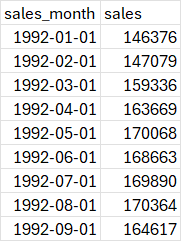


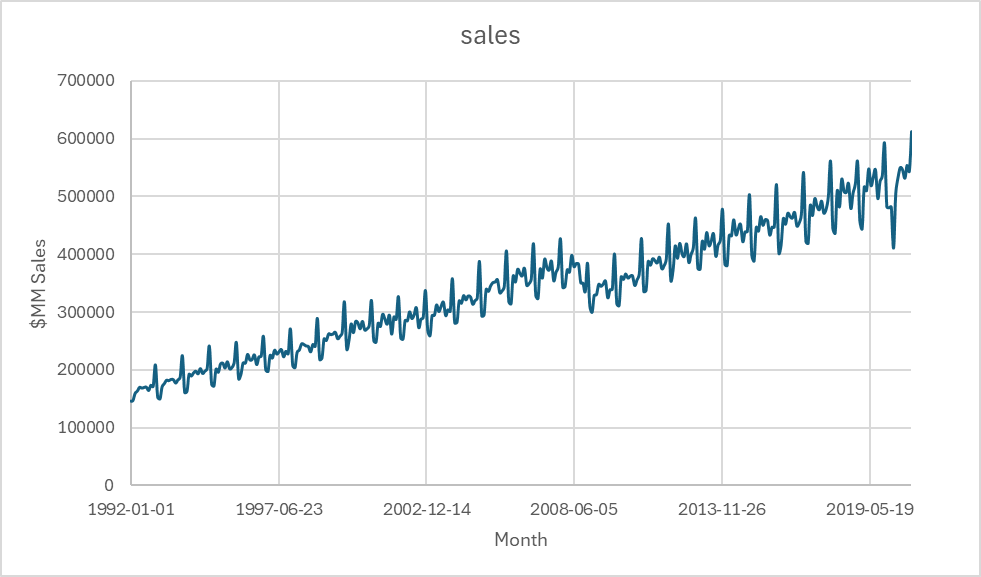.


```SQL
SELECT date_part('year', sales_month) AS sales_year
	,SUM(sales) AS sales
FROM retail_sales
WHERE kind_of_business = 'Retail and food services sales, total'
GROUP BY 1
;
```

Results

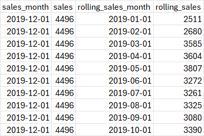

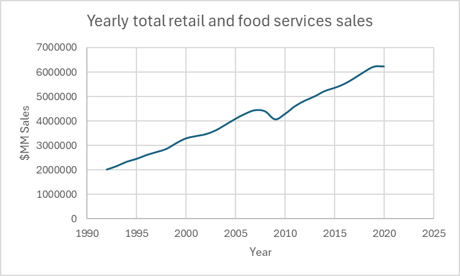


**Comparing Components**
- compare the yearly sales trends for a few categories that are associated with leisure activities: book stores, sporting goods stores, and hobby stores

```SQL
SELECT date_part('year',sales_month) AS sales_year
	,kind_of_business
	,SUM(sales) AS sales
FROM retail_sales
WHERE kind_of_business IN ('Book stores','Sporting goods stores','Hobby, toy, and game stores')
GROUP BY 1, 2
ORDER BY 1,2
;
```

Results 

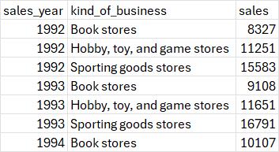


- sales at women's clothing stores and at men's clothing stores

```SQL 
SELECT sales_month
	,kind_of_business
	,sales
FROM retail_sales
WHERE kind_of_business IN ('Men''s clothing stores', 'Women''s clothing stores')
;
```

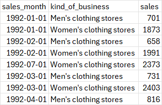


- for more precision you can calculate the gap between the two categories, the ratio and the percent difference between them

```SQL 
SELECT date_part('year', sales_month) AS sales_year
	,SUM(CASE WHEN kind_of_business = 'Women''s clothing stores'
			  THEN sales
			  END) AS womens_sales
	,SUM(CASE WHEN kind_of_business = 'Men''s clothing stores'
			  THEN sales
			  END) AS mens_sales
FROM retail_sales
WHERE kind_of_business IN ('Men''s clothing stores', 'Women''s clothing stores')
GROUP BY 1
ORDER BY 1
;
```

Results
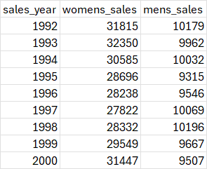


- we can find the diffference, ratio and percent difference between time series in the data set

```SQL 
SELECT sales_year
	,womens_sales - mens_sales AS womens_minus_mens
	,mens_sales - womens_sales AS mens_minus_womens
FROM 
(	
	SELECT date_part('year', sales_month) AS sales_year
		,SUM(CASE WHEN kind_of_business = 'Women''s clothing stores'
				  THEN sales
				  END) AS womens_sales
	   ,SUM(CASE WHEN  kind_of_business = 'Men''s clothing stores'
		   		 THEN sales
		   		 END) AS mens_sales
	FROM retail_sales
	WHERE kind_of_business IN ('Men''s clothing stores', 'Women''s clothing stores')
	AND sales_month <= '2019-12-01'
	GROUP BY 1
)a
;
```

Results

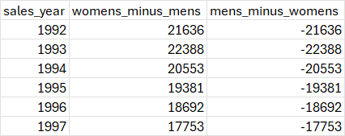


- the subquery is not required from a query execution standpoint, since aggregations can be added to or subtracted from each other. 
- a subquery is often more legible but does add more lines to the code 
- this is an example without the subquery

```SQL
SELECT date_part('year', sales_month) AS sales_year
	,SUM(CASE WHEN kind_of_business = 'Women''s clothing stores'
			  THEN sales END)
   -
   SUM(CASE WHEN kind_of_business = 'Men''s clothing stores'
	  		THEN sales END)
   AS womens_minus_mens
FROM retail_sales
WHERE kind_of_business IN ('Men''s clothing stores', 'Women''s clothing stores')
AND sales_month <= '2019-12-01'
GROUP BY 1
;
```


Results

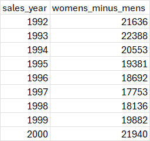

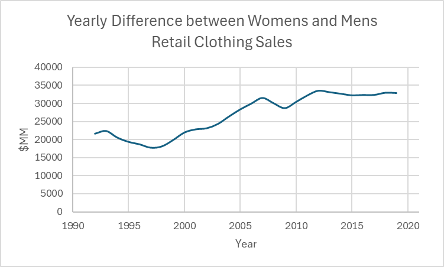


- ratio of these categories with men's sales as the denominator 

```SQL 
SELECT sales_year
	,womens_sales / mens_sales AS womens_times_mens
FROM 
(
	SELECT date_part('year', sales_month) AS sales_year
		  ,SUM(CASE WHEN kind_of_business = 'Women''s clothing stores'
			  		THEN sales
			  		END) AS womens_sales
		 ,SUM(CASE WHEN kind_of_business = 'Men''s clothing stores'
				   THEN sales
				   END) AS mens_sales
	FROM retail_sales
	WHERE kind_of_business IN ('Men''s clothing stores', 'Women''s clothing stores')
	AND sales_month <= '2019-12-01'
	GROUP BY 1
) a
;
```

Results 

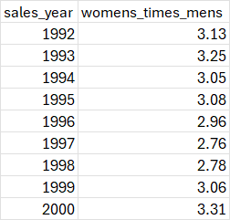

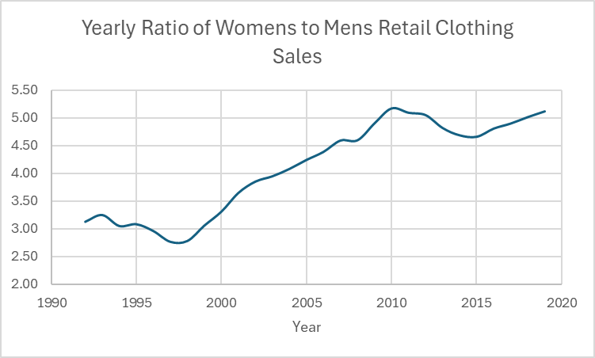


- calculating the percent difference between sales at women's and men's clothing stores 

```SQL 
SELECT sales_year 
	,(womens_sales / mens_sales - 1) * 100 AS womens_pctg_of_mens
FROM 
(	SELECT date_part('year', sales_month) AS sales_year
 		   ,SUM(CASE WHEN kind_of_business = 'Women''s clothing stores'
			   THEN sales
			   END) AS womens_sales
 		   ,SUM(CASE WHEN kind_of_business = 'Men''s clothing stores'
			    THEN sales
			    END) AS mens_sales
 			FROM retail_sales
 			WHERE kind_of_business in ('Men''s clothing stores', 'Women''s clothing stores')
 			AND sales_month <= '2019-12-01'
  			GROUP BY 1
) a 
;
```


Results 


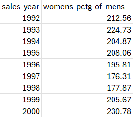


**Percent of Total Calculations**

```SQL 
SELECT sales_month
	,kind_of_business
	,sales * 100 / total_sales as pctg_total_sales
FROM 
(
	SELECT a.sales_month, a.kind_of_business, a.sales
		   ,SUM(b.sales) AS total_sales
	FROM retail_sales a 
	JOIN retail_sales b ON a.sales_month = b.sales_month
	AND b.kind_of_business IN ('Mens''s clothing stores', 'Women''s clothing stores')
	WHERE a.kind_of_business IN ('Men''s clothing stores', 'Women''s clothing stores')
	GROUP BY 1,2,3
) aa
;
```


Results 


- you can also use the SUM window function and to partition by sales month 


```SQL
SELECT sales_month
	,kind_of_business
	,sales 
	,SUM(sales) OVER (PARTITION BY sales_month) AS total_sales
	,sales * 100 / SUM(sales) OVER (PARTITION BY sales_month) AS pctg_total
FROM retail_sales 
WHERE kind_of_business IN ('Men''s clothing stores', 'Women''s clothing stores')
ORDER BY 1
;
```

Results 


- percent sales within a longer time period, such as percent yearly sales each month represents 

```SQL 
SELECT sales_month 
	,kind_of_business
	,sales * 100/ yearly_sales AS pctg_yearly
FROM 
(
	SELECT a.sales_month 
		  ,a.kind_of_business 
		  ,a.sales
		  ,SUM(b.sales) AS yearly_sales
	FROM retail_sales a 
	JOIN retail_sales b ON date_part('year', a.sales_month) = date_part('year', b.sales_month)
		AND a.kind_of_business = b.kind_of_business 
		AND b.kind_of_business IN ('Men''s clothing stores', 'Women''s clothing stores')
		WHERE a.kind_of_business IN ('Men''s clothing stores', 'Women''s clothing stores')
		GROUP BY 1, 2, 3
) aa
;
```

Results 


- the window function method can be used 

```SQL 
SELECT sales_month
	 ,kind_of_business 
	 ,sales
	 ,SUM(sales) OVER (PARTITION BY date_part('year', sales_month) ,kind_of_business) AS yearly_sales
	 ,sales*100 / SUM(sales) OVER (PARTITION BY date_part('year', sales_month), kind_of_business) AS pctg_yearly
FROM retail_sales
WHERE kind_of_business IN ('Men''s clothing stores', 'Women''s clothing stores')
ORDER BY 1
;
```


Results 


**Percent Change over Time**
