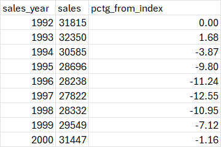
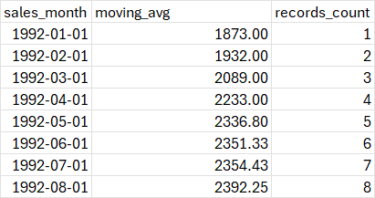

# Chapter 3: Time Series Analysis 

## Trending the Data

**Simple Trends**
```SQL
SELECT sales_month
	,sales
FROM retail_sales
WHERE kind_of_business = 'Retail and food services sales, total'
;
```
Results


.


```SQL
SELECT date_part('year', sales_month) AS sales_year
	,SUM(sales) AS sales
FROM retail_sales
WHERE kind_of_business = 'Retail and food services sales, total'
GROUP BY 1
;
```

Results





**Comparing Components**
- compare the yearly sales trends for a few categories that are associated with leisure activities: book stores, sporting goods stores, and hobby stores

```SQL
SELECT date_part('year',sales_month) AS sales_year
	,kind_of_business
	,SUM(sales) AS sales
FROM retail_sales
WHERE kind_of_business IN ('Book stores','Sporting goods stores','Hobby, toy, and game stores')
GROUP BY 1, 2
ORDER BY 1,2
;
```

Results 


- sales at women's clothing stores and at men's clothing stores

```SQL 
SELECT sales_month
	,kind_of_business
	,sales
FROM retail_sales
WHERE kind_of_business IN ('Men''s clothing stores', 'Women''s clothing stores')
;
```


- for more precision you can calculate the gap between the two categories, the ratio and the percent difference between them

```SQL 
SELECT date_part('year', sales_month) AS sales_year
	,SUM(CASE WHEN kind_of_business = 'Women''s clothing stores'
			  THEN sales
			  END) AS womens_sales
	,SUM(CASE WHEN kind_of_business = 'Men''s clothing stores'
			  THEN sales
			  END) AS mens_sales
FROM retail_sales
WHERE kind_of_business IN ('Men''s clothing stores', 'Women''s clothing stores')
GROUP BY 1
ORDER BY 1
;
```

Results
